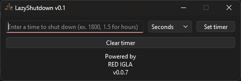

# 🕒 LazyShutdown

**LazyShutdown** — A special, convenient utility for setting a timer to shut down your PC.

---

## ✨ Features

* 📅 **Flexibility:** Support for a wide range of units of measurement (from seconds to days)
* 🧹 **Clearing:** Cancel all active timers with one button
* 🧸 **Fully portable:** Just download an `.exe` file and run!
---

## 🛠️ Installation

### Windows
 - Download [latest release](https://github.com/RED-IGLA/LazyShutdown/releases) of utility
 - Extract the `.zip` and run `LazyShutdown.exe`

## 🖥️ Usage

1. Set the time you need (you can set it to 300 seconds or 1.5 hours)
2. Select the type of time you need
3. Click "Set timer" and go about your business, the computer will turn off itself!

### 💎 Note
You can clear all active timers by clicking the "Clear timer" button.

## 📄 License

This project is distributed under the **MIT** license. Details are in the file [LICENSE](LICENSE).

# 🎉 Enjoy !